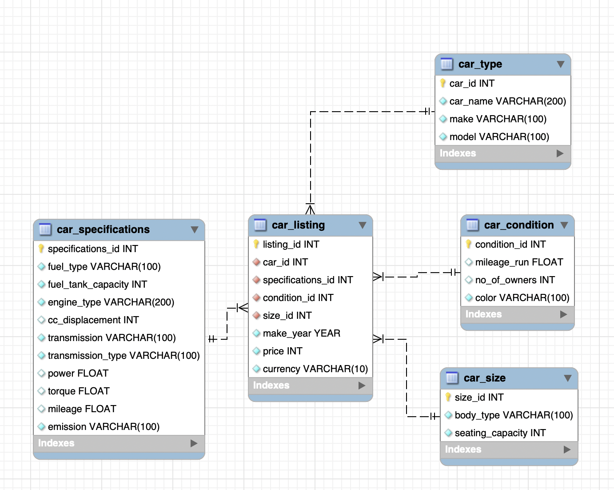

# dgervi-DE1.2

# Author: Domantas Gervinskas


# Project Introduction: Car Data Warehouse for analytics

This project sets up a data warehouse for a car trading startup similar to Carvana. The goal is to import, clean, and process the car data scraped from a website, normalize it to 2NF, split it into smaller dataframes, and store them in a MySQL database. Additionally, some exploratory data analysis (EDA) is performed to gain insights into the data. Finally, a view is created to enable efficient data retrieval for data analysts.

## Prerequisites / Requirements

- Python 3.11
- MySQL database

## Goals

- Set up a data warehouse for the car trading startup using MySQL database.
- Create a new user for the MySQL database access.
- Normalize the data to 2NF to eliminate redundancy and ensure data integrity.
- Create an ERD showing relationships between tables.
- Perform EDA to gain insights into the data.
- Create MySQL database and tables directly from Python, with Primary and Foreign keys.
- Populate the tables with data from panda Dataframes.

## EDA (Exploratory Data Analysis)

The exploratory data analysis includes:

- Data type conversions and fixing incorrect encodings.
- Handling missing values, outliers and duplicates.

## Features

- Import and preprocess data using pandas.
- Data normalization to 2NF.
- Unique key creation in pandas.
- Create, configure and setup a MySQL database from Python using mysql.connector and sqlalchemy.
- Create tables with appropriate column names and data types.
- Load data from from Python environment into the database.

## Usage

1. Clone the repository.

```
git clone https://github.com/TuringCollegeSubmissions/dgervi-DE1.2.git
cd dgervi-DE1.2/
```

2. Install the required Python packages using the following command:

```
pip install -r requirements.txt
```

3. Set up a MySQL database and create a new user.

- ERD as defined in the configuration:
  

**Creating user:**

- Open Terminal or MySQL CLI/Workbench
- Login as administrator
  `mysql -u root -p`
- Create a new user with password and privileges:

```
CREATE USER 'admin_3'@'localhost' IDENTIFIED BY 'random_pass';
GRANT ALL PRIVILEGES ON cars.* TO 'admin_3'@'localhost';
FLUSH PRIVILEGES;
```

4. Run the Python script to import, preprocess, normalize the data.

5. Login to the MySQL database from Python.

```
  import db_config
```

6. Create MySQL database tables and Primay/Foreign key relationships from Python.

7. Populate database tables with data from panda Dataframes.

## Suggestions for Improvement

- Modularize the code by using Classes and Class Methods.
- Handle errors and exceptions more effectively during data processing - i.e. currently only try-except block is implemented to handle possible dtype conversions. The current approach only prints a message without handling the error. Adding proper error handling or logging would be more effective.
